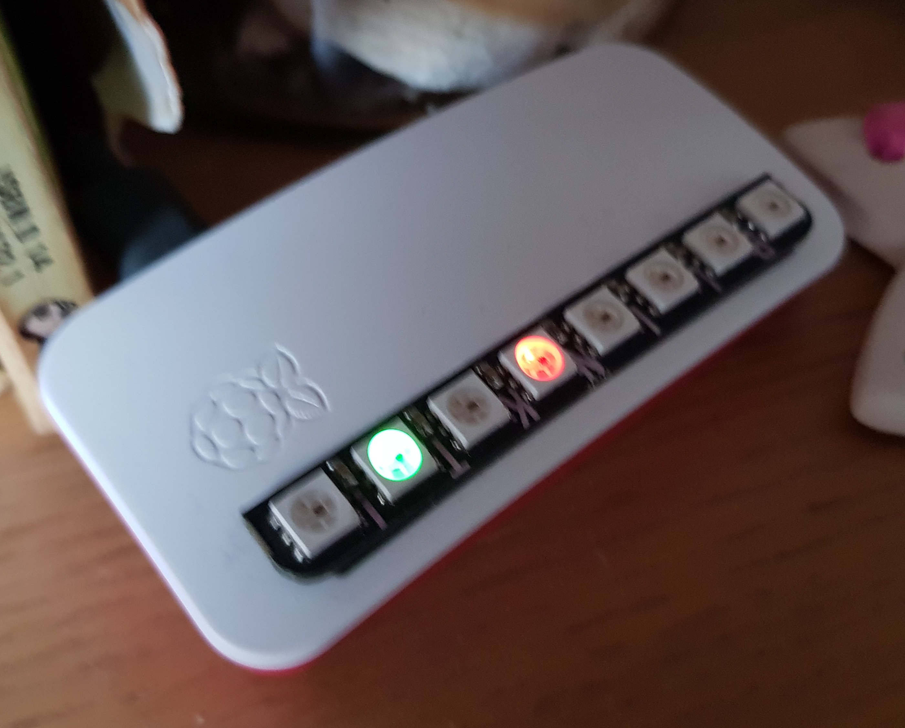

# PiTrains
Live train notification tool for Raspberry Pi and Blinkt!
A live UK train departure board to check before you walk out the door.
Uses the OpenLDBWS service to show the live running status of direct trains between your specified stations.
## EXAMPLE

## ABOUT
There are two different versions available at present.
### PiTrainsImprovedMode.py
Each of the eight LEDs on the Blinkt represents a 5 minute time window. The colour of each LED indicates the train(s) available in that time window:
1. Black/Unlit = no train.
2. White = a train is imminent/on platform/just left.
3. Green = an on-time train.
4. Yellow = a delayed train (this is the actual delayed time, not the pre-delay scheduled time.)
5. Blue = unspecified delay (there was supposed to be a train, but it is delayed and the delay period is not specified.)
6. Red = a cancelled train (there was supposed to be a train, but now it's not coming.)
If there are multiple trains in the time window, the "best" LED state is set - White>Green>Yellow>Blue>Red>Black.
### PiTrainsLegacyMode.py
The eight LEDs show the expected state of the next (up to) 8 trains, in order.
1. Green = an on-time train.
2. Yellow = a delay of up to 10 minutes.
3. Blue = an unspecified delay.
4. Red = a delay of more than 10 minutes, or a cancelled train.
## ENVIRONMENT
1. Make sure the time on your Pi is correct.
2. Install Python blinkt package.
3. Install Python nre-darwin-py package.
4. Sign up for OpenLDBWS and get your API key: http://realtime.nationalrail.co.uk/OpenLDBWSRegistration/
5. Create DARWIN_WEBSERVICE_API_KEY environment variable (your API key)
6. Create DEPARTURE_CRS_CODE environment variable (see http://www.railwaycodes.org.uk/crs/CRS0.shtm)
7. Create DESTINATION_CRS_CODE environment variable (see http://www.railwaycodes.org.uk/crs/CRS0.shtm)
8. Run on cron.
## ANSIBLE
If you're familiar with Ansible, you can use `main.yml` to deploy PiTrains on to a fresh Pi.
